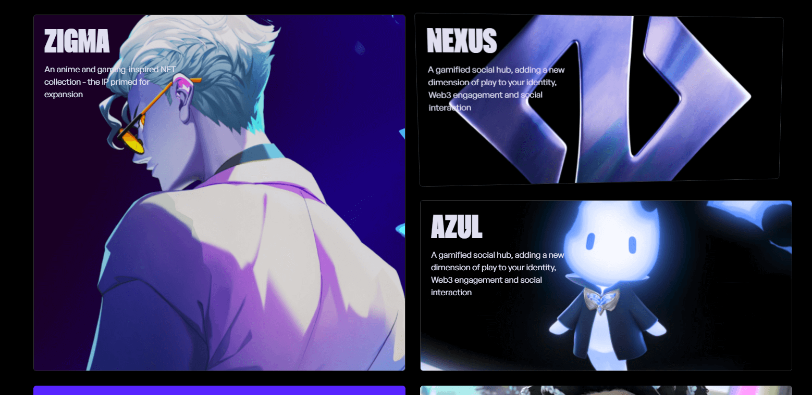

# Description 

This project is a showcase of my skills in React, featuring advanced scroll animations, responsive design, and high-quality video integration. Inspired by the award-winning Zentry website, this project aims to deliver a sleek, immersive experience that could stand out as an Awwwards-worthy site.

With a strong focus on performance and aesthetics, the page combines smooth transitions, dynamic content loading, and cutting-edge design principles to create a user experience that's both functional and visually stunning.

# Main Features
- React
- GSAP
- Scroll Animations
- Responsive Design
-  UI/UX Design

# 📷 Screenshots

